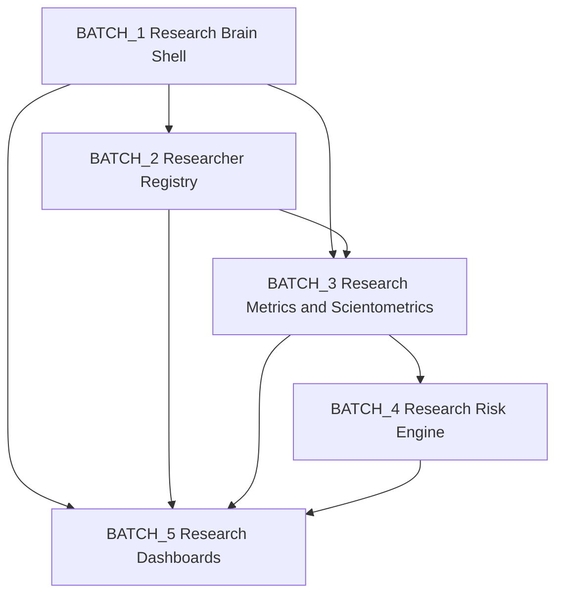

# A-047.5-SPEC - Research Brain Runtime Implementation Plan Report

Date: 2026-06-09
Mode: implementation planning only
Scope guard: no backend/frontend/schema/database/test/runtime code changes
Anti-fake mode: enforced

## 1. Task 0 - Source Validation

Status: PASS

Validated:
- `A-047.4-B2-RESEARCH_BRAIN_CONTRACT_NORMALIZATION_REPORT.md` exists
- `runtime_readiness = READY_FOR_RUNTIME_WITH_BRIDGES` is recorded in trackers and A-047.4.B2
- `next_action_id = A-047.5-SPEC` is recorded in trackers

Blocking status:
- NOT_BLOCKED

source_validation:
- PASS

## 2. Task 1 - Runtime Decomposition

Research Brain is decomposed into five executable batches. Every runtime element maps to existing canonical modules and bridge families.

| Batch | Objective | Owner | Canonical modules | Bridge modules | Dependencies | Risks |
| --- | --- | --- | --- | --- | --- | --- |
| BATCH_1 Research Brain Shell | Establish single canonical runtime shell and orchestration contract for research-brain execution | `research_science` | `research_science`, `research`, `research_ethics` | `analytics`, `brain_core`, `document_workflow` | normalized ownership from A-047.4.B2, existing dashboard/health/bridge surfaces | semantic overlap with standalone pages, route alias confusion |
| BATCH_2 Researcher Registry | Define canonical researcher registry runtime around existing faculty/PI references | `research_science` | `research_science` | `research`, `research_ethics`, `publication_registry`, `research_projects` | BATCH_1 shell contract, identifier reconciliation policy | identity fragmentation, duplicate researcher records |
| BATCH_3 Research Metrics and Scientometrics | Define metrics/scientometrics runtime using analytics as owner and metadata-only boundaries | `analytics` | `analytics` | `research_science`, `publication_registry`, `research`, `brain_core` | BATCH_1 shell integration, BATCH_2 researcher identity map | provider unavailability, citation source completeness |
| BATCH_4 Research Risk Engine | Define research risk signal runtime as brain-core owned, human-review gated | `brain_core` | `brain_core` | `analytics`, `research_science`, `research`, `research_ethics` | BATCH_3 metrics plane, existing alerts/context sources | false confidence risk, escalation policy inconsistency |
| BATCH_5 Research Dashboards | Define executive/operations/grant/publication/scientometrics/risk dashboard runtime sequence | `research_science` (domain), `analytics` (metrics), `brain_core` (risk) | `research_science`, `analytics`, `brain_core` | `research`, `research_ethics`, `publication_registry`, `document_workflow` | BATCH_1 through BATCH_4 complete | dashboard duplication, RBAC scope drift |

runtime_decomposition:
- PASS

## 3. Task 2 - Bridge Implementation Map

Bridge map (planning contract):

| SOURCE | TARGET | READ | WRITE | SIGNALS | DASHBOARD |
| --- | --- | --- | --- | --- | --- |
| `research_science` | `publication_registry` | publication metadata and identity keys | curated publication metadata updates | `publication_risk`, `citation_decline` candidate input | Publication Dashboard, Scientometrics Dashboard |
| `research_science` | `research_grants` | grant portfolio snapshots and lifecycle references | grant status metadata harmonization | `grant_risk`, `project_delay` candidate input | Grant Dashboard, Research Operations Dashboard |
| `research_science` | `research_ethics` | ethics reviews, brain context, committee outcomes | ethics request metadata and amendment references | `ethics_risk` | Research Risk Dashboard, Research Operations Dashboard |
| `research_science` | `analytics` | KPI, trends, insights, events, recommendations | controlled refresh triggers only (human initiated) | `productivity_drop`, `citation_decline` candidate input | Executive, Operations, Scientometrics dashboards |
| `research_science` | `brain_core` | risk/signal context outputs and review candidates | review queue acknowledgements and status annotations | full research signal family consumption | Research Risk Dashboard |
| `research_science` | `document_workflow` | evidence/document metadata and workflow status | evidence linkage metadata only | supports evidence-backed signal review | Operations and audit-aligned dashboard facets |

Bridge governance rules:
- no provider auto-sync
- no autonomous approval
- all writes remain metadata-only and human-review-gated

bridge_mapping:
- PASS

## 4. Task 3 - Researcher Registry Spec

Canonical researcher registry entity plan:

| Entity | Classification | Owner | Notes |
| --- | --- | --- | --- |
| `researcher` | NEW | `research_science` | canonical person-level research runtime record; bridges existing faculty/PI identifiers |
| `laboratory` | BRIDGE | `research` (source), consumed by `research_science` | existing lab APIs in `research` are reused through shell normalization |
| `research_group` | NEW | `research_science` | planning entity linking researchers, labs, and project clusters |
| `supervision` | REUSE | `research_science` | existing supervision surfaces and statuses are available |
| `publication_profile` | BRIDGE | `research_science` + `publication_registry` | profile aggregates publication metadata and citation-adjacent fields |

Registry anti-fake constraints:
- identity claims must be evidence-linked
- no hidden score fields
- no provider-verified labels unless provider lane is explicitly implemented in later action

researcher_registry_spec:
- PASS

## 5. Task 4 - Scientometrics Spec

SCIENTOMETRICS_READINESS_MATRIX

| Provider | Provider Status | Runtime Need | Bridge Need | Risk |
| --- | --- | --- | --- | --- |
| Scopus | FUTURE_PROVIDER | high for external citation enrichment | `analytics` <-> `research_science` | provider lock-in, quota limits, data licensing |
| Web of Science | FUTURE_PROVIDER | high for citation quality/comparative indexing | `analytics` <-> `research_science` | licensing and institutional entitlement variability |
| ORCID | FUTURE_PROVIDER | medium-high for researcher identity normalization | `analytics` <-> `research_science` <-> researcher registry | identity mismatch, partial profile coverage |
| DOI | FUTURE_PROVIDER | medium for publication identity integrity | `publication_registry` <-> `analytics` | identifier quality and stale metadata |
| Google Scholar | FUTURE_PROVIDER | medium for broad citation trend baselines | `analytics` <-> publication profile | unstable scraping/parsing assumptions, provenance noise |

Scientometrics planning constraints:
- runtime remains metadata and evidence based until provider lanes are explicitly implemented
- all provider-derived metrics require provenance tags and human-review labels

scientometrics_spec:
- PASS

## 6. Task 5 - Research Risk Engine Spec

Signal-family runtime plan:

| Signal | Signal Owner | Source | Consumer | Review Queue | Escalation |
| --- | --- | --- | --- | --- | --- |
| `publication_risk` | `brain_core` | publication status/review evidence from `research_science` + `research` | publication ops, risk reviewers | research review queue | dean/research-admin escalation |
| `grant_risk` | `brain_core` | grant delay indicators and grant status from `research` + `research_science` | grant managers, executive operations | grants review queue | vice-rector science escalation |
| `ethics_risk` | `brain_core` | ethics reviews/high-risk outputs from `research_ethics` | ethics committee, compliance leads | ethics review queue | ethics committee escalation |
| `citation_decline` | `brain_core` | analytics trend/citation signals (bridge) | scientometrics operators, executives | scientometrics review queue | research strategy board escalation |
| `productivity_drop` | `brain_core` | KPI throughput trends from `analytics` | operations leadership | productivity review queue | faculty dean escalation |
| `supervision_overload` | `brain_core` | supervision load records from `research_science` | department coordinators | supervision review queue | dean/supervision board escalation |
| `laboratory_underutilization` | `brain_core` | lab utilization snapshots from `research` health | lab operations, research ops | lab optimization queue | operations director escalation |
| `project_delay` | `brain_core` | project status history from `research_science` + `research` | project portfolio managers | project delay queue | project governance board escalation |

Risk-engine guardrails:
- advisory signals only
- human-reviewed escalation only
- no autonomous enforcement/action

risk_engine_spec:
- PASS

## 7. Task 6 - Dashboard Spec

| Dashboard | Classification | Rationale |
| --- | --- | --- |
| Research Executive Dashboard | BRIDGE | consumes `research_science` shell + `analytics` KPI + `brain_core` risk summaries |
| Research Operations Dashboard | REUSE | extends existing `research_science` operational dashboard/health surfaces |
| Grant Dashboard | BRIDGE | merges `research_science` and `research` grant views with analytics trend overlays |
| Publication Dashboard | BRIDGE | merges `research_science` publications with publication-registry identity and analytics trends |
| Scientometrics Dashboard | NEW | no canonical scientometrics dashboard currently exists |
| Research Risk Dashboard | BRIDGE | brain-core signal/risk owner with research-science presentation shell |

dashboard_spec:
- PASS

## 8. Task 7 - Implementation Order

Dependency graph:

Execution sequence:
1. BATCH_1 Research Brain Shell
2. BATCH_2 Researcher Registry
3. BATCH_3 Research Metrics and Scientometrics
4. BATCH_4 Research Risk Engine
5. BATCH_5 Research Dashboards

EARLIEST_RUNTIME_BATCH:
- BATCH_1

LATEST_RUNTIME_BATCH:
- BATCH_5

implementation_order:
- PASS

## 9. Task 8 - Risk Review

Batch-level risk classification:

| Batch | TECHNICAL | DATA | PROVIDER | SECURITY | RBAC |
| --- | --- | --- | --- | --- | --- |
| BATCH_1 | route/shell overlap across existing pages | inconsistent summary payloads | none immediate | tenant boundary bleed if shell contracts drift | inconsistent named-role mapping |
| BATCH_2 | identity merge logic complexity | duplicate or stale faculty/PI references | ORCID dependency deferred | PII exposure in profile aggregates | researcher vs admin scope ambiguity |
| BATCH_3 | KPI/scientometrics normalization complexity | citation field sparsity and trend quality | Scopus/WoS/Scholar/DOI availability constraints | provenance tampering risk | metrics access granularity gaps |
| BATCH_4 | signal threshold calibration complexity | weak source confidence for some signals | indirect provider effects via metrics | escalation misuse risk | approval vs reviewer permission drift |
| BATCH_5 | cross-dashboard consistency complexity | dashboard reconciliation mismatch | provider-ready labels may be misread as live sync | overexposed executive data slices | role-based dashboard access drift |

risk_review:
- PASS

## 10. Task 9 - Final Readiness

Decision:
- READY_FOR_RUNTIME_IMPLEMENTATION

Evidence:
- A-047.4.B2 resolved contract-level blockers and normalized ownership/routes/RBAC/signals/dashboards/providers.
- A-047.5 defines full implementation sequencing (batches, dependencies, risks) without introducing new contract ambiguity.
- Every planned runtime element maps to existing canonical modules and/or explicitly identified bridge families.
- Anti-fake boundaries remain intact across provider, review, and escalation contracts.

runtime_readiness:
- READY_FOR_RUNTIME_IMPLEMENTATION

## 11. Task 10 - Report Output

Created file:
- `A-047.5-SPEC-RESEARCH_BRAIN_RUNTIME_IMPLEMENTATION_PLAN_REPORT.md`

## 12. Final Output

A-047.5 RESULT

source_validation:
- PASS

runtime_decomposition:
- PASS

bridge_mapping:
- PASS

researcher_registry_spec:
- PASS

scientometrics_spec:
- PASS

risk_engine_spec:
- PASS

dashboard_spec:
- PASS

implementation_order:
- PASS

risk_review:
- PASS

runtime_readiness:
- READY_FOR_RUNTIME_IMPLEMENTATION

next_action_id:
- A-047.5-B1

final_verdict:
- PASS
